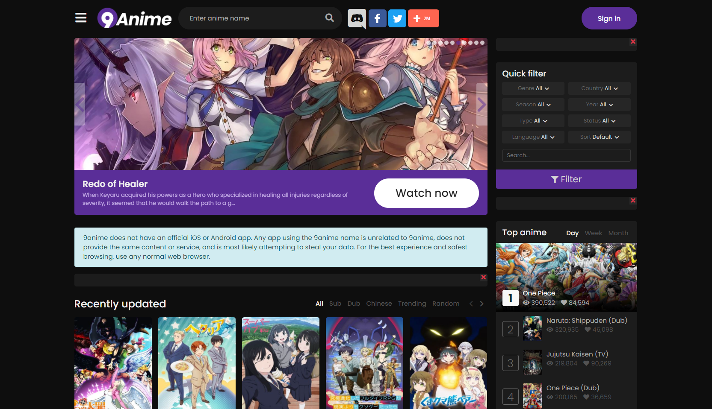

# The Accessibility of Anime Streaming Sites

## Digital Humanities 110 - Michelle Tran Bui
Thinking back to what websites and apps I use the most, streaming websites came to the top of the list. More often than not, I watch animes on my free time. The two websites that I frequent the most when looking for something new is KissAnime and 9Anime. Both websites have different shows that in their catalogue, as well as varying levels of video quality and uplooad speeds. On both streaming platforms, my core task is to browse through the homepage for an anime to watch and observe the usability issues between the two anime streaming websites. Considering the growing population of people watching anime online, analyzing the usability of these websites helps me understand the user experience and efficiency of the sites. 

### Nielson's 10 Heuristics
Heuristic | Definition
--------- | ----------
**Visibility of system status** | The user is given feedback about the system's current state. 
**Match between system + real world** | The design follows real life conventions that are natural to follow and have concepts familiar to the user. 
**User control and freedom** | The user can freely undo, redo, and exit the current interaction at any given time. 
**Conistency and standards** | The designs uses the same consistent words and actions to establish a pattern of familiarity. 
**Recognition rather than recall** | The interface is presented so that users can easily recognize what to do without excessive memorization. 
**Error prevention** | Prevent problematic scenarios by warning users as well as having helpful restraints.
**Flexibility and efficiency of use** | The product is flexible to customize and personalize, as well as acceleration for advanced users. 
**Aesthetic and minimalist design** | The design is sleek and includes relevant essentials that embody the purpose of the product. 
**Help users with errors** | When users stumble upon errors, they are easy to comprehend and are given solutions. 
**Help and documentation** | Further documentation and elaboration is given to users if needed. 

### Severity Score for Usability Issues 
A 1 to 3 rating scale is used to rate the severity of usability issues: 
Rating | Significance
------ | ------------
1 | Low priority - Issues are mainly cosmetic and don't infringe on the user experience.
2 | Medium priority - There is still functionality but users are presented with more obstacles to navigate the website. Issues should be fixed when time is available.
3 | High priority - Issues heavily dampen the experience and functionality is almost down to zero. Users are faced with high usability issues which should be fixed as soon as possible.

### KissAnime
> KissAnime is a mildly popular anime streaming website that has frequent updates of new episodes and new shows. Many of the most popular ongoing animes are consistently uploaded, but sometimes the episodes are not of the highest video and/or audio quality. Dubbed animes, which are when the voices are 'dubbed' over in English rather than being spoken in the traditional Japanese language are also available to watch on KissAnime. 

http://kiss-anime.ws

#### Evaluation
> *Overall: Although KissAnime has a great variety of animes to choose from, there are still many design issues before it becomes as sleek, modern, and useful as popular streaming platforms like Netflix. To better improve the user experience, KissAnime needs to become more personalized for the user and have features that will streamline accessing the website. There are many navigation, efficiency, and aesthetic issues on the website that build into the usability problems.*

Heuristic | Score | Evaluation | Improvement
--------- | -------- | ---------- | -----------
**Visibility of system status** |2| **Good**: Images of shows and the show title darken when hovering over them.  Various buttons and actions throughout the homepage also darken when hovering. **Bad**: Shows that I'm currently watching are not displayed on the homepage. Instead, popular and new shows are displayed rather than shows that are relevant to me. | **Improvement**: Shows the user are currently watching could be displayed on the homepage for ease of access, as well as the progress of that show. 
**Match between system + real world** |1| **Good**: There are arrows to scroll through more shows, as well as a search bar to specifically find something. **Bad**: There is an "Advanced Search" button, which is vague as to what that entails. Animes are displayed with their Japanese title despite being an American streaming platform. | **Improvement**: Modify the "Advanced Search" option to be more concise on what it does and change the titles of animes to their American name rather than their Japanese name. 
**User control and freedom** |3| **Bad**: There is no obvious "Go Back" button besides the "Back" on your Internet engine. After clicking on a new show, the only user freedom is selecting the "Home" button. Clicking on a specific episode also has no navigation to the show's general page, and you are only given the choice to select through more episodes. | **Improvement**: There should be an option to go back to the pages you were originally browsing through, even after clicking on a certain show. Another button to go back to the anime's general page would also be useful. 
**Conistency and standards** |1| **Good**: There is a consistent structure to the format of shows and opening episodes. There is also consistency between presenting "Ongoing" animes versus "Completed" animes, as well as what episode the anime is currently on. | **No Improvement**: The standardization throughout the homepage and navigating animes is done conventionally well. There is nothing to modify in regards to increasing consistency.
**Recognition rather than recall** |2| **Good**: The search engine recognizes your search before you complete it and gives you suggestions. The most popular animes are also presented rather than forcing user memory recall. If you've watched an episode, the episode's title is darker to indicate that you've watched it. **Bad**: Shows that you are currently watching are not shown anywhere, forcing users to remember what episode of whichever anime they are watching. You could also have uncompleted episodes but KissAnime only indicates that you've watched it, and doesn't remember where you have stopped. | **Improvement**: Have a dedicated area to shows that you are watching as well as save the episode progress.
**Error prevention** |3| **Bad**: If there is a typo in your spelling of the anime's title, the engine can not help you look for similar spellings. Any accidental clicking of an episode that is saved as "Watched" can not be undone either. | **Improvement**: The search engine can be more flexible and accomodating to users' searches and there should be an option to modify the progress of a show. 
**Flexibility and efficiency of use** |2| **Good**: There is customization and personalization of the animes that you've already watched. There is also the ability to "bookmark" specific shows so that you can return to them, but that is only useful if you have created a profile with the account. The "bookmarks" are a shortcut to a specific anime. **Bad**: There is still extra navigation if you're looking for a very niche show or a show that you forgot to save. | **Improvement**: Reduce the amount of steps to navigate to a show and a specific episode, as well as the amount of steps to return to a show that has been saved. 
**Aesthetic and minimalist design** |3| **Bad**: The design of the website is outdated and not pleasing to look at. The typography is a little messy and overwheming in some areas, and the structure of the buttons/blocks are very sharp and harsh. | **Improvement**: Round out the harsh edges throughout the website and update the design to be more modern and sleek. 
**Help users with errors** |3| **Bad**: Error notifications are vague and take a long time to load. There are incomprehensible error codes and no solutions are given to the problem. | **Improvement**: Specify what the problem is and omit any unnecessary error codes. Solutions should also be given rather than not helping the user with the issue at hand whatsoever.
**Help and documentation** |3| **Bad**: There is no FAQ or page that has documentation of common issues and problems with the website. The only resource is to report issues through Facebook messages, which is an unneccesary step for users to find solutions or explanations on their issues. | **Improvement**: Have a dedicated FAQ page that has documentation of most commonly asked questions or problems to smoothen out the process for users. 

### 9Anime 
> Another popular anime streaming website is 9Anime. With it's more modernized design, it has an easy to navigate website when looking for new, ongoing, and completed animes. There is even an option to view the "Schedule" of animes that are bound to be released soon,, and when they will come out. 9Anime has the most popular animes on its website with varying levels of quality depending on their release.

http://9anime.to

https://9anime.to/home

#### Evaluation
> *Overall: 9Anime has a pleasant and easy-to-navigate design once you access the homepage. However, if you access the main page, it seems to be extremely bleak and inactive. By adjusting the access to the website to the more relevant main page, user usability would definitely become more accessible. There are moderate problems throughout the website that inhibit the user experience, but the website is generally successful in keeping the user's purpose in mind.*

Heuristic | Score | Evaluation | Improvement
--------- | -------- | ---------- | -----------
**Visibility of system status** |3| **Bad**: None of the buttons on the website change in any way to indicate that they work or that you are hovering over them. The website is very static and seems like it is even inactive as it doesn't give feedback to the user at all. | **Improvement**: Include small interactions between the website and user to indicate that the website is indeed active and responsive to the user's actions. 
**Match between system + real world** |2| **Good**: A search bar is present to look for a specific show, as well as "A-Z" buttons to access an anime title with the corresponding letter. There is also a menu button with a dropdown list of other pages that you can access. **Bad**: There is barely anything on this website that represents anything in real life. As the website is so blank, it looks unfamiliar to the user. | **Improvement**: Make the starting page more natural and recognizable to the user while presening information the is relevant as well. 
**User control and freedom** |1| **Good**: Once clicking on an episode, there are buttons to navigate back to the main page of the anime as well as back to the anime. After searching for an anime, you can also go back to the Home page with easy navigation. | **No Improvement**: Users are given good control and freedom to navigate back to their original spot. There is also an easy exit button if needed. 
**Conistency and standards** |2| **Good**: There is good consistency throughout the website when navigating for new, popular, and upcoming animes. The jargon throughout the website is familiar to users and easy to follow. **Bad**: The starting page is very different from the actual home page. You also have to click another button to access the home page, rather than being immediately directed to it when accessing the main page. | **Improvement**: Make the home page the actual starting page instead of the basic search bar page to improve consistency. 
**Recognition rather than recall** |2| **Good**: There is a filter and magnifying glass button that users can recognize in terms of their function. Much of the website layout is easy to recognize rather than needing to remember a specific navigation pattern. **Bad**: Suggestions are not given as you're typing the title of a show. If you have a typo when searching for a show, the search engine is not capable of similar answers which forces the user to recall the complete name. | **Improvement**: There should be more flexibility in the search engines capability to suggest shows as you are typing as well as suggest titles that are similarly spelled in the case that you spell something wrong. 
**Error prevention** |1| **Good**: Episode progess is saved in the case that you leave in the middle of the website. You can also go back to the previous page in the case that you made an error in accessing the website. | **No Improvement**: There are a good amount of precautions set in place to prevent any user error. 
**Flexibility and efficiency of use** |1| **Good**: Episodes that have been watched are indicated in a different color. Episode progress is also saved. The most relevant and basic functions are all presented as you go throughout the website and there are shortcuts to specific animes if you bookmark them. | **No Improvement**: The website is mindful of user personalization in remembering what episodes have been watched and saving your episode progress. 
**Aesthetic and minimalist design** |2| **Good**: The aesthetic and layout of the home page is easy to navigate as well as pleasing to look at. The design is not cluttered and has what the user needs. **Bad**: The landing page is very basic and bland, as well as inactive. Because of the two different pages, the usability of the website is confusing. | **Improvement**: Modify the landing page to be as useful and aesthetic as the actual home page. 
**Help users with errors** |1| **Good**: In the case of an error, there is an easy way to report the error to the website. However, I have not experienced any possible error issues so I'm not sure of how this heuristic ranks in regards to usability issues. | **No Improvement**: Due to lack of experience, there seems to be nothing to really modify in regards to this heuristic. 
**Help and documentation** |2| **Good**: There is a FAQ, Contact, and Request page at the bottom of the website. There is decent documentation on frequently asked questions that are presented in one area for users. **Bad**: The FAQ doesn't really address popular issues that users might experience, nor give the solutions for them. | **Improvement**: Add a FAQ page that addresses popular problems as well as working solutions to solve those issues. 
