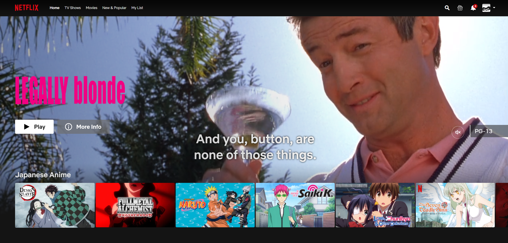

# The Accessibility of Streaming Sites

## Digital Humanities 110 - Michelle Tran Bui
Thinking back to what websites and apps I use the most, Netflix and Crunchyroll came to the top of that list. I frequently use these two streaming platforms to relax in my free time and search for new shows to watch--which are typically animes. With Netflix being one of the most, if not the most popular streaming platform, it's design is quite seamless and easy to navigate. On both streaming platforms, my core task is to search for an anime and observe the usability issues between the top American streaming platform Netflix, and the top anime streaming platform Crunchyroll. 

### Nielson's 10 Heuristics
Heuristic | Definition
--------- | ----------
**Visibility of system status** | The user is given feedback about the system's current state. 
**Match between system + real world** | The design follows real life conventions that are natural to follow and have concepts familiar to the user. 
**User control and freedom** | The user can freely undo, redo, and exit the current interaction at any given time. 
**Conistency and standards** | The designs uses the same consistent words and actions to establish a pattern of familiarity. 
**Recognition rather than recall** | The interface is presented so that users can easily recognize what to do without excessive memorization. 
**Error prevention** | Prevent problematic scenarios by warning users as well as having helpful restraints.
**Flexibility and efficiency of use** | The product is flexible to customize and personalize, as well as acceleration for advanced users. 
**Aesthetic and minimalist design** | The design is sleek and includes relevant essentials that embody the purpose of the product. 
**Help users with errors** | When users stumble upon errors, they are easy to comprehend and are given solutions. 
**Help and documentation** | Further documentation and elaboration is given to users if needed. 

### Netflix
> Netflix is the second most-downloaded video-on-demand apps of 2020, with Disney+ placing in first. It's service is to provide viewers with a plethora of shows, documentaries, and movies anywhere and anytime, on your tablet, smartphone, computer, and more. Viewers can also access international shows with subtitles in different languages, giving the audience freedom to watch what their heart desires. 

http://netflix.com

#### Evaluation
> Overall: 

Heuristic | Evaluation | Improvement
--------- | ---------- | -----------
**Visibility of system status** | 
**Match between system + real world** |
**User control and freedom** |
**Conistency and standards** |
**Recognition rather than recall** |
**Error prevention** |
**Flexibility and efficiency of use** |
**Aesthetic and minimalist design** |
**Help users with errors** | 
**Help and documentation** |

### Crunchyroll 
>

http://crunchyroll.com

#### Evaluation
> Overall:

Heuristic | Evaluation | Improvement
--------- | ---------- | -----------
**Visibility of system status** | 
**Match between system + real world** |
**User control and freedom** |
**Conistency and standards** |
**Recognition rather than recall** |
**Error prevention** |
**Flexibility and efficiency of use** |
**Aesthetic and minimalist design** |
**Help users with errors** | 
**Help and documentation** |
