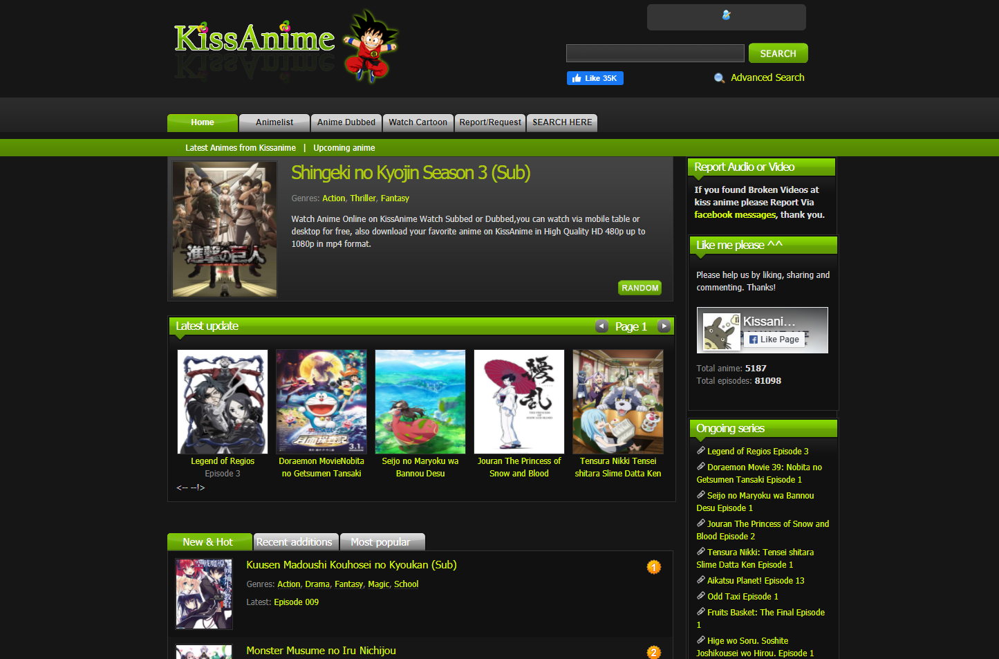
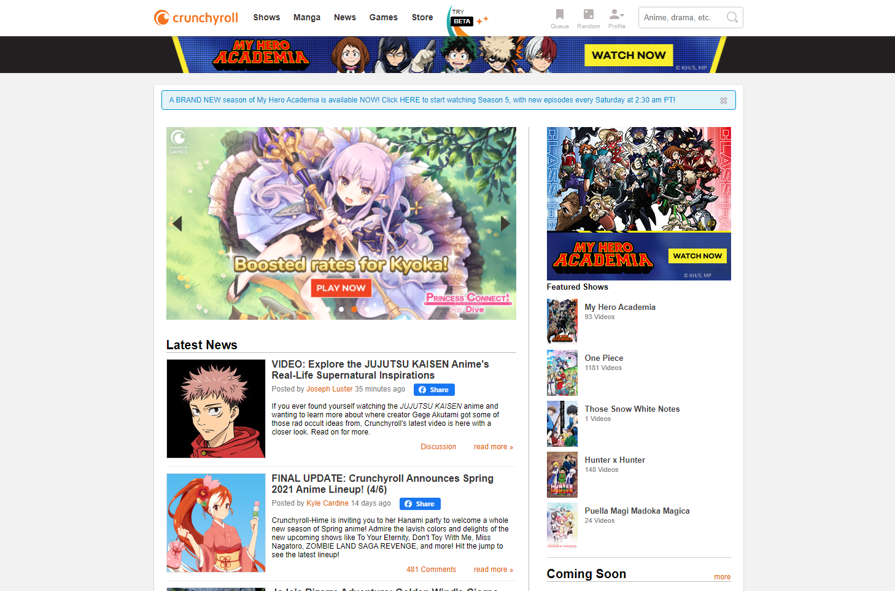

# The Accessibility of Streaming Sites

## Digital Humanities 110 - Michelle Tran Bui
Thinking back to what websites and apps I use the most, streaming websites came to the top of the list. More often than not, I watch animes on my free time. The two websites that I frequent the most when looking for something new is KissAnime and Crunchyroll. Both websites have different shows that in their catalogue, as well as varying levels of video quality and uplooad speeds. On both streaming platforms, my core task is to browse through the homepage for an anime to watch and observe the usability issues between the two anime streaming websites. 

### Nielson's 10 Heuristics
Heuristic | Definition
--------- | ----------
**Visibility of system status** | The user is given feedback about the system's current state. 
**Match between system + real world** | The design follows real life conventions that are natural to follow and have concepts familiar to the user. 
**User control and freedom** | The user can freely undo, redo, and exit the current interaction at any given time. 
**Conistency and standards** | The designs uses the same consistent words and actions to establish a pattern of familiarity. 
**Recognition rather than recall** | The interface is presented so that users can easily recognize what to do without excessive memorization. 
**Error prevention** | Prevent problematic scenarios by warning users as well as having helpful restraints.
**Flexibility and efficiency of use** | The product is flexible to customize and personalize, as well as acceleration for advanced users. 
**Aesthetic and minimalist design** | The design is sleek and includes relevant essentials that embody the purpose of the product. 
**Help users with errors** | When users stumble upon errors, they are easy to comprehend and are given solutions. 
**Help and documentation** | Further documentation and elaboration is given to users if needed. 

### KissAnime
> 

#### Evaluation
> Overall: 

Heuristic | Evaluation | Improvement
--------- | ---------- | -----------
**Visibility of system status** | **Good**: Show is enlarged when you hover your selection over it. Buttons also change colors when hovering over it to show where you are, and cursor is visible. Displays shows that you're currently watching and the progress of the show. | **None**: There are good indicators within the website that give you immediate feedback and don't subject any consequiences to users. 
**Match between system + real world** | **Good**: 
**User control and freedom** |
**Conistency and standards** |
**Recognition rather than recall** |
**Error prevention** |
**Flexibility and efficiency of use** |
**Aesthetic and minimalist design** |
**Help users with errors** | 
**Help and documentation** |

### Crunchyroll 
>

http://crunchyroll.com

#### Evaluation
> Overall:

Heuristic | Evaluation | Improvement
--------- | ---------- | -----------
**Visibility of system status** | 
**Match between system + real world** |
**User control and freedom** |
**Conistency and standards** |
**Recognition rather than recall** |
**Error prevention** |
**Flexibility and efficiency of use** |
**Aesthetic and minimalist design** |
**Help users with errors** | 
**Help and documentation** |
