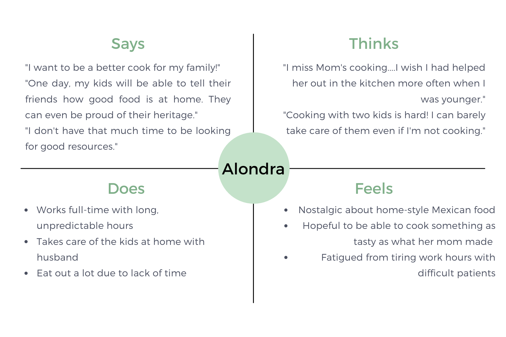

# Personas and Scenarios
## Digital Humanities 110 - Michelle Tran Bui 

### The Purpose of UX Storytelling
> UX Storytelling is important for the purpose of understanding what the user needs, accomodating their motivations and desires, and to make their experience as easy, memorable, and satisfactory as possible. For my project, UX storytelling is imperative so I can modify and adjust a Cooking Website to cater to a wide variety of people--from students, to full-time workers, and more. By imagining different populations of users, I can diversify the features, effectiveness, and utility of the website. 

### Design Features
##### 1. Short, Entertaining Videos
> Embed/link videos that are short and entertaining tutorials on how to make a certain dish.
##### 2. Categories & Filters
> Allow users to filter through specific cultural categories of food or genres of food.
### Personas & Empathy Map 
#### Persona 1: Albert Evans

#### Albert's Empathy Map

#### Persona 2: Alondra Martinez

#### Alondra's Empathy Map

### User Scenarios and Journey Maps 

#### Albert's Scenario
#### Alondra's Scenario
