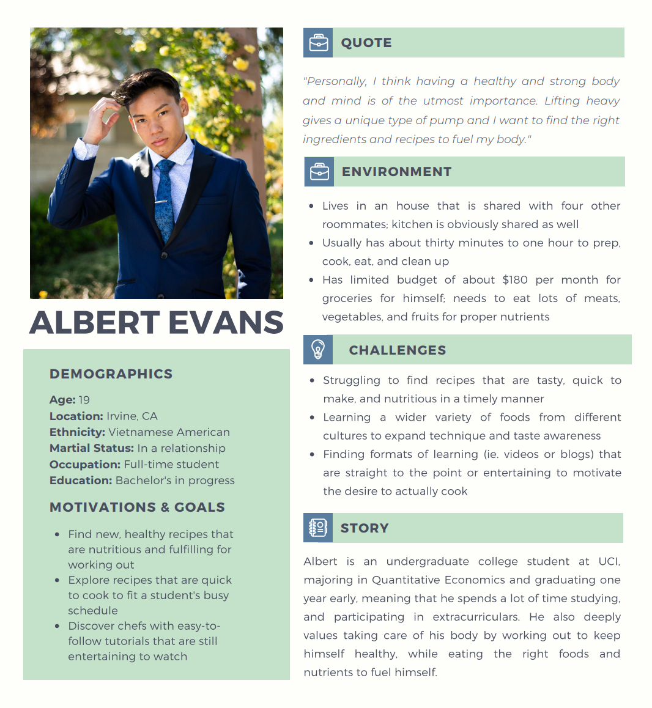
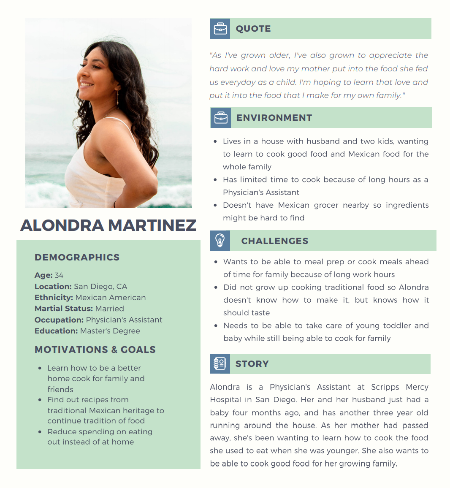

# Personas and Scenarios
## Digital Humanities 110 - Michelle Tran Bui 

### The Purpose of UX Storytelling
> UX Storytelling is important for the purpose of understanding what the user needs, accomodating their motivations and desires, and to make their experience as easy, memorable, and satisfactory as possible. For my project, UX storytelling is imperative so I can modify and adjust Slim Palate to cater to a wide variety of people--from students, to full-time workers, and more. By imagining different populations of users, I can diversify the features, effectiveness, and utility of the website. 

### Design Features
##### 1. Short, Entertaining Videos
> Embed/link videos that are short and entertaining tutorials on how to make a certain dish.
##### 2. Categories & Filters
> Allow users to filter through specific cultural categories of food or genres of food.
### Personas & Empathy Map 
#### Persona 1: Albert Evans

#### Albert's Empathy Map

#### Persona 2: Alondra Martinez

#### Alondra's Empathy Map

### User Scenarios and Journey Maps 
#### Albert's Scenario
* Albert is still an undergraduate student studying Quantatitive Economics at the University of California, Irvine. He's aiming to graduate one year early, which means he's now very busy with classes, clubs, and organizations. Despite that, he still values taking care of his body by giving it the proper nutrients as well as working out to keep himself healthy and fit. Considering that he doesn't have that much time, he's been wanting to expand his cooking expertise by learning new recipes and techniques from different cultures. He only has about fourty-five minutes to spare in looking for a new, yummy, protein-rich meal, preparing it, eating it, and cleaning up. 
* Albert opens up Slim Palate in a new tab right after he finished studying to start preparing dinner. He wants to specifically look for meals that can be made in a short time frame, and is slightly panicked when he remembers how little time he has to eat. Luckily, Albert realizes that there's a feature that simply categories recipes into exactly what he's looking for! He finds the specific category of "Quick Meals" and browses around for 5 minutes to find something that is intriguing as well as having the proper intake that he needs (high in protein, lots of vegetables/fibers, healthy fats and carbohydrates). Albert's worried that it'll be difficult fo find something he wants to eat that also doesn't take a lot of time to make, and is somewhat overwhelmed by the plethora of "Quick Meals" that he has to navigate through. However, he finds out that he can further narrow down his search by adding in filters like "protein" or "lift heavy", which gave him meals that are specific to that type of target audience. He's able to find a recipe he wants to make at the end of the five minutes, and the recipe takes 10 minutes of prep, and 15 minutes to cook. Albert is now feeling a little more calm after realizing how many of the meals suggested were very nutritious, delicious, and fulfilling. He now starts on the recipe, and is able to eat his meal at a nice, unrushed pace before he cleans up to catch up on a little more reading for his Urban Economics class. 
#### Alondra's Scenario
*
