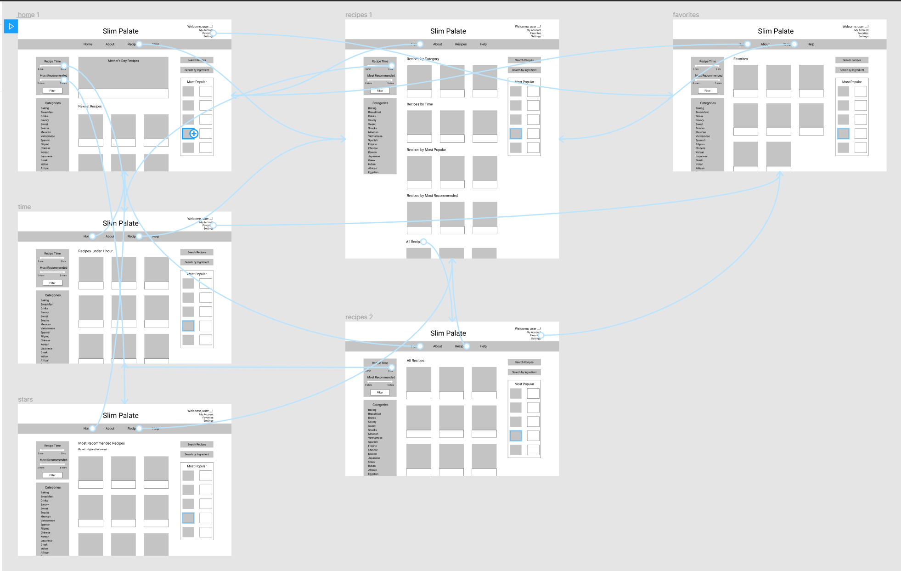

# Low Fidelity Prototype
## Digital Humanities 110 - Michelle Tran Bui 
### Overview
**Description:** This project is focused on creating a user-friendly cooking website that has a plethora of recipes that are easy to access, find, and use. The website helps specific audiences ie. powerlifters, athletes, or the elderly to find recipes that suit their dietary needs, and time allotment. These three features will be introduced to the website to improve user experience and ease of access.
> **Recipe Time Tool**: Finds recipes that is within the time frame you need it to be. 

> **Favorites Bookmark**: Gives the user the ability to save recipes they want to use in the future, and users can access all their favorited recipes in a specific tab.

> **Recommendation Tool**: Compiles user ratings and reviews on the recipe and recommends which recipes are the most popular with the highest ratings.

**Purpose:** The purpose of creating and testing this low-fidelity prototype is to see whether the features being introduced are implemented properly, are useful to the audience, and if there are any issues with them. By having participants use the features and see any difficulties or advantages that they experience, I can further the advancement of these features by better modifying them. The tasks will specifically ask the user if the features are useful, if there's anything odd about them that can be improved on, and if the user can find out how to use the feature itself. 

### Wireframes and Wireflows
Click [here](https://www.figma.com/file/W6XW8iPkdqQONopaFiHZab/?node-id=0%3A1) to access the wireframes and [here](https://www.figma.com/file/W6XW8iPkdqQONopaFiHZab/?node-id=2%3A3) to access the wireflows. To see wireflow, click on Prototype page. The wireflow can also be seen through [this](https://youtu.be/KmaYXbZyT3I) screen-recording and is also shown here. 

[Here](https://drive.google.com/file/d/1MKni5cG6mujFnYqwhNUhqKFmGLNbs31D/view?usp=sharing) is the PDF for the wireframes.
#### Prototype Testing
[Here](https://youtu.be/ehIOGkQbHD0) is the video of the user testing the low-fidelity prototype. 

#### Notes on Wireflow Test

**Task 1: The Favorites Bookmark**
> The user noted that the Favorites Bookmark is useful and something they would use in the feature. They said that it's not difficult to find and follows natural logic to find, and explained that their difficulty in finding it was just not looking at the website properly. Based off of their usage, I don't think there is much to modify to improve the feature. 
> Improvements: Possibly make the bookmark tool more noticeable and memorable for users. Can add a graphic instead of the words 'Favorites'.

**Task 2: Recipe Time Tool**
> When testing out the second feature, the Recipe Time Tool, the participated said how the scroll bar is inefficient and confusing when looking for recipes that fit a specific time. He recommended two different options: either a 'type bar' where the user can input the maximum amount of time they have for a certain recipe, or a 'select all' type of function where there a different checkboxes for different amounts of time that the user can select. The user did say this feature would be useful for the cooking website, but thinks there can be better implementation for the purpose of the feature. 
> Improvements: Change the scroll bar to a search bar, or checkbox type of feature. 

**Task 3: Recommendation Tool**
> For the final task, the user also mentioned the same type of perspective as he did for the second feature. He believes that instead of a scroll bar for the 'Recommendation Tool', that having 'stars' that you can click up to would be much easier to use for this type of purpose. Another comment was that when reaching the landing page for however many stars you selected up to, he commented that the "Rated" filter is unnecessary if the user is already inputting how many stars they want in regards to recommendation. 
> Improvements: Change the scroll bar to stars, or a checkbox type of feature. Remove the 'Rated' function on the following 'Recommendation' page. 

The user successfully completed all components of the three tasks outlined in the low-fidelity prototype test. 
> Further improvements outside of the features: Incorporate the title, cook time, and rating for each recipe displayed on the website. Consider combining the Recipe Tool, Recommendation Tool, and Categories function all into one tool to filter through needed filters in one area. This could potentially be easier for users to utilize. 

### Summary
Actually creating the low-fidelity wireframes and prototypes is one of the most tedious processes in UI/UX design. Despite that, I think wireframing and prototyping is also one of the most fun processes. It forces me to think from the user perspective and imagine what type of logical reasoning would be most ideal for the flow of the website, and what type of features, components, and elements would be the most useful. Drafting the wireframes and prototypes also helped me learn the most about the way elements are organized, and what's both aesthetic as well as efficient. Having to combine these two factors is quite a challenge, which I realized as I was drafting my own wireframes and prototypes. Not only that, conducting the user testing on the prototype was interesting to see. Being able to have another participant use the prototype gave me suggestions and ideas I definitely would have not independently came up with. There were also other recommendations outside of the three tasks in the prototype testing that my participant gave to me, which overall helps in the process of improving the website design and flow. I think it was very helpful in using an online program like Figma to draft up my prototypes and wireframes because it made the overall process of improving, adjusting, and testing much more stream-lined. Through the user testing, I realized little mistakes that I didn't recognize during the design process, which really helped nitpick the little obstacles and struggles that a uiser would experience. Overall, I think the process was a great learning tool in advancing my skills for wireframing, prototyping, and testing. 

