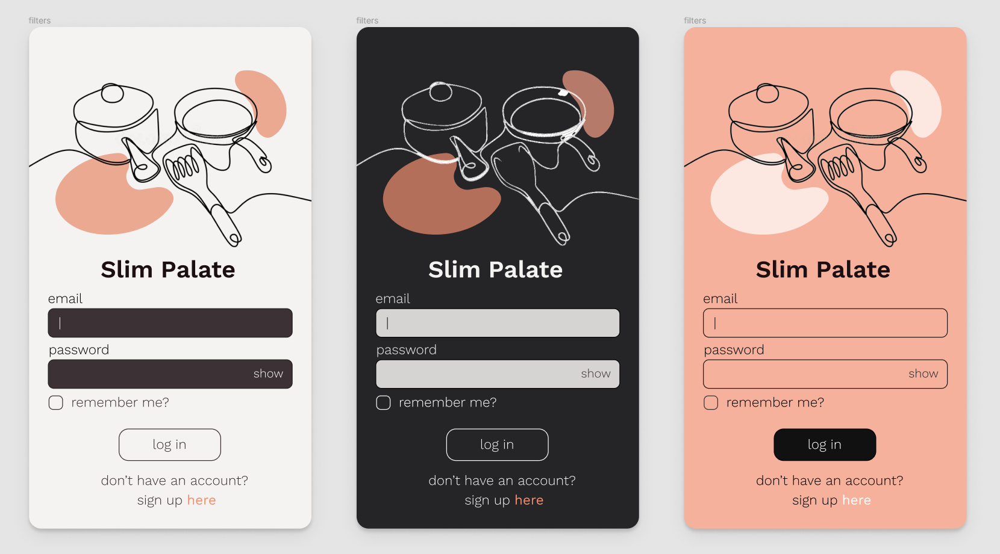
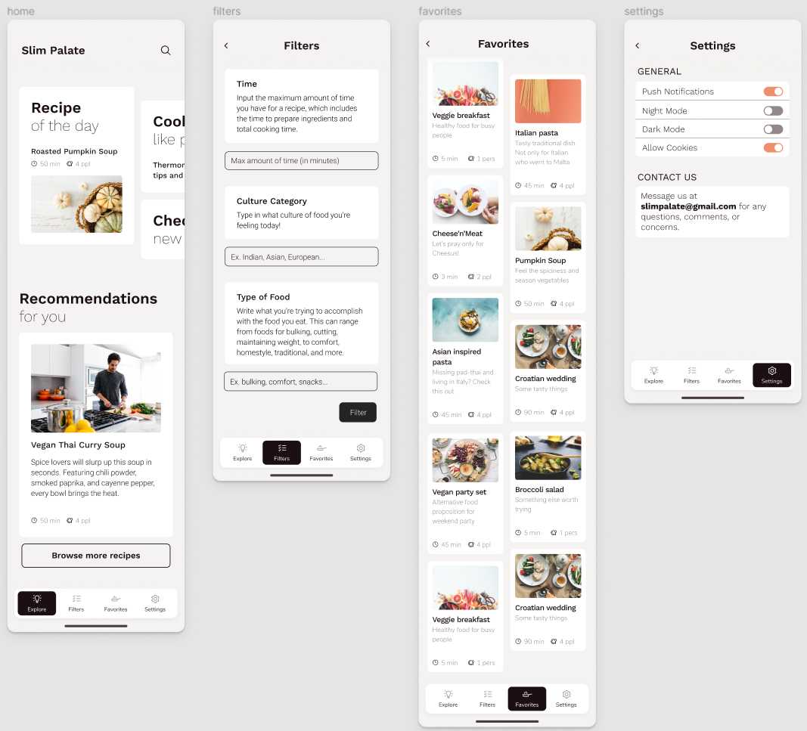
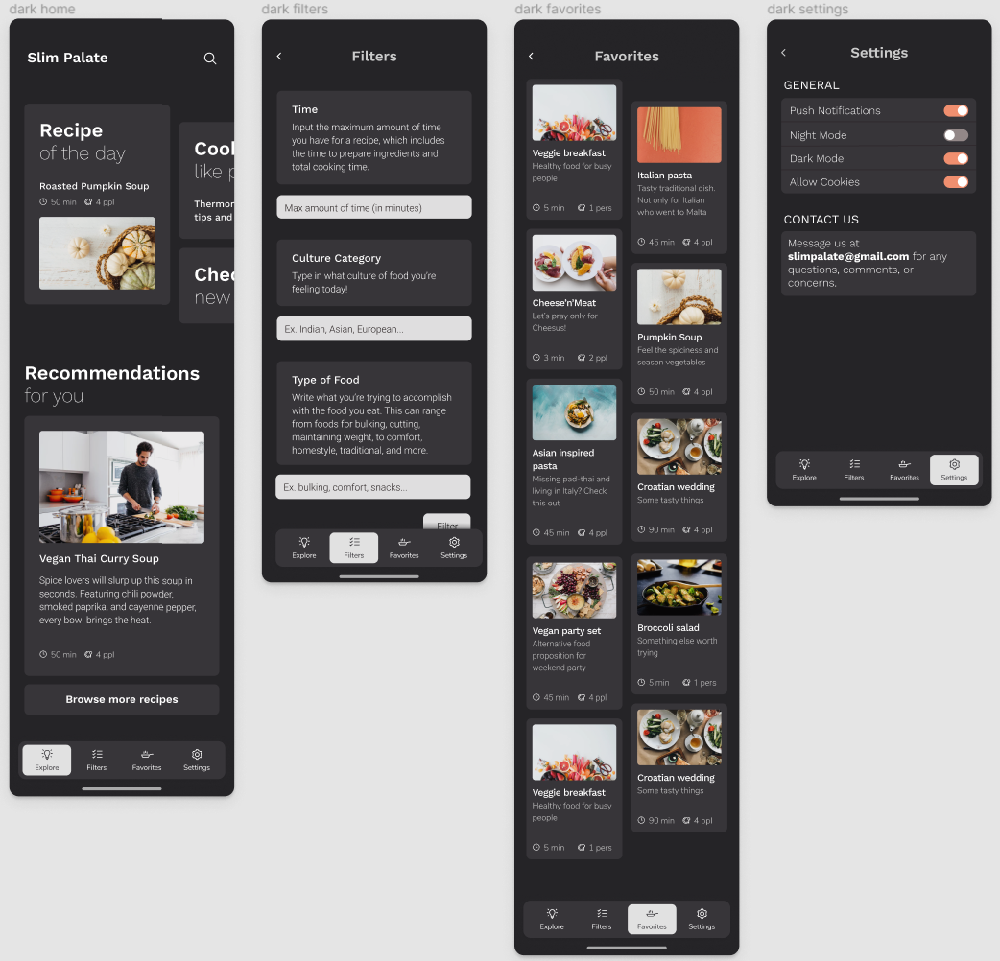
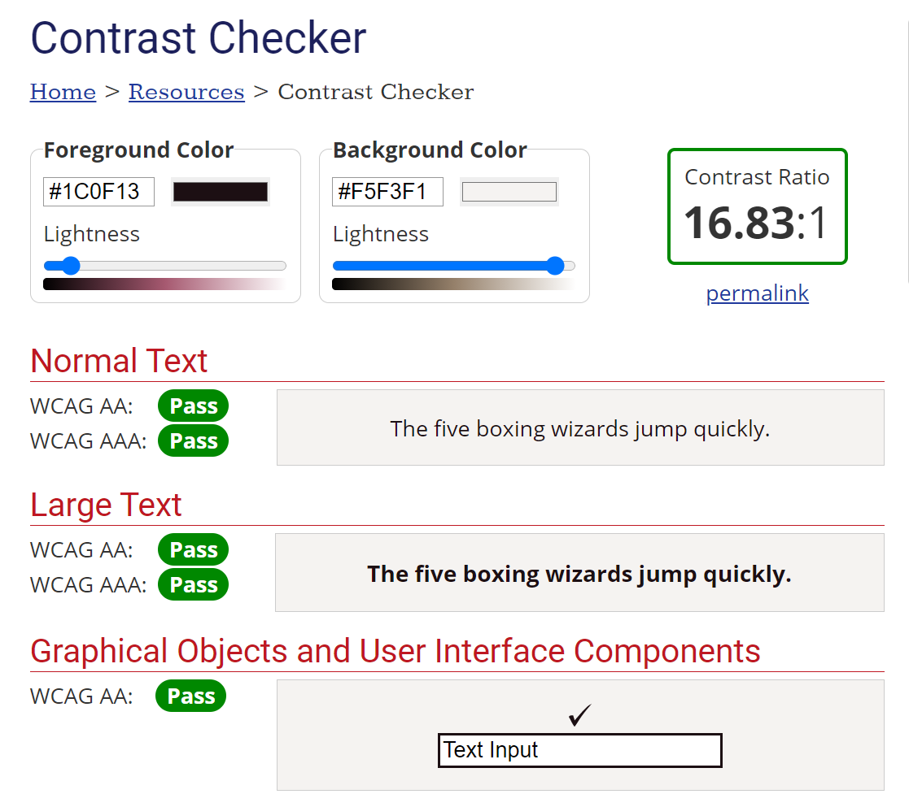
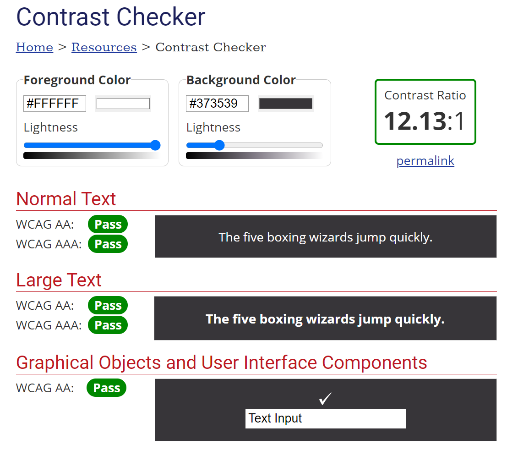
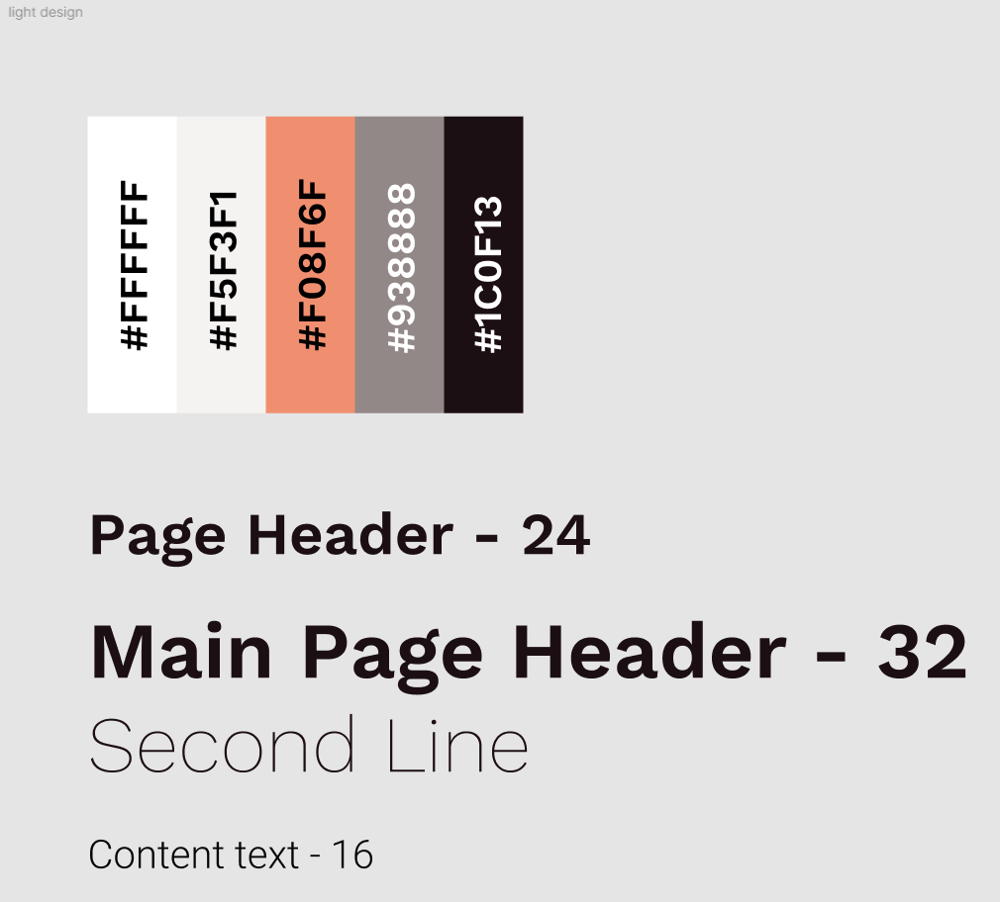
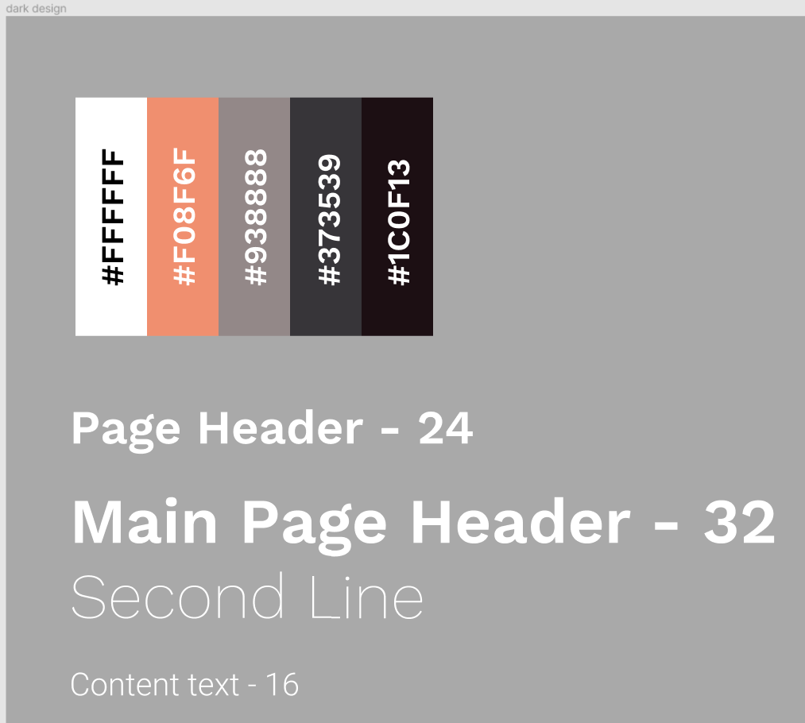

# Interactive Prototypying

## Digital Humanities 110 by Michelle Tran Bui 

### Description
This project focuses on being able to visualize and design a new 'Slim Palate' website in order to conceptualize the aesthetics of the website, the usability and efficiency in the eyes of the user, and the materialization and incorporation of tasks introduced to the website. 

#### Purpose
The purpose of the high-fidelity prototype is to see whether or not my design of 'Slim Palate' is cognitively functional, if the impression on users is positive or negative, and what further user feedback can be discovered to adjust and improve the prototype. The prototyping also serves to discover any mistakes in the design and to fix them immediately to ensure that the user experience is simple and seamless.

#### Tasks
The tasks that will be demonstrated will be the incorporation of three features: 

> **Favorites Bookmark:** The Favorites Bookmark gives the user the ability to save recipes they want to use in the future, and users can access all their favorited recipes in a specific tab.

> **Recipe Time Tool:** The Recipe Time tool finds recipes that is within the time frame you need it to be, allowing the user to personalize their needs and find what they need faster. 

> **Recommendation Tool:** The Recommendation tool features a multitude of categories like the genre/ethnicity/culture of the food as well as what category of food you are looking to make (ie. food for maintaining weight, bulking food, cutting food, comfort food, energy-rich food).
### Screen Design

#### Design Variations

Here are the three different color variations being tested for the general app color scheme. The three modes are light mode, dark mode, and a color mode/variant. For the final product of the app, I decided to stick with the light and dark modes so users have the ability to toggle between both modes. I discarded the color mode variant as a potential idea because I think the more minimalistic color schemes have a nicer aesthetic for the overall design.

#### Screens

These are the final four screens that the user can scroll through in the app. The screens are designed to be scrolling, so more content will show up as the user continues to scroll down the app. Each screen is representative of the navigation bar on the bottom. Hence, there are four pages: Explore, Favorites, Filters, and Settings. 

### Impression Test

### Accessibility Check

To ensure that the mobile application is accessible, I conducted a WCAG color-pair contrast test. Both of the light and dark mode variants with their respective font colors passed the accessibility checks.

### Design System 

>**Decision Making Process:** When thinking of the color schemes for my mobile app, I looked at other cooking app and recipe apps for inspiration. Personally, my favorite color schemes happened to have a more minimalist, clean look that looked sleek and simple. As a result, the colors I ended up choosing were a parchment-like color, as well as a dark gray color for the dark mode variant. The final pop of color, which is similar to the color of an apricot, was added because that's the color I think of when I think of food--a bright, vibrant color that we see often in the fruits and vegetables that we eat. For the fonts, I chose a simple sans serif font so the app looks more casual and user-friendly, rather than something that looks overly professional.

**STOP HERE, BELOW IS NEXT WEEK**
### Interactive Prototype

### Wireflow

### Cognitive Walkthrough

#### Summary

### Reflection
#### Summary
#### Future Changes
