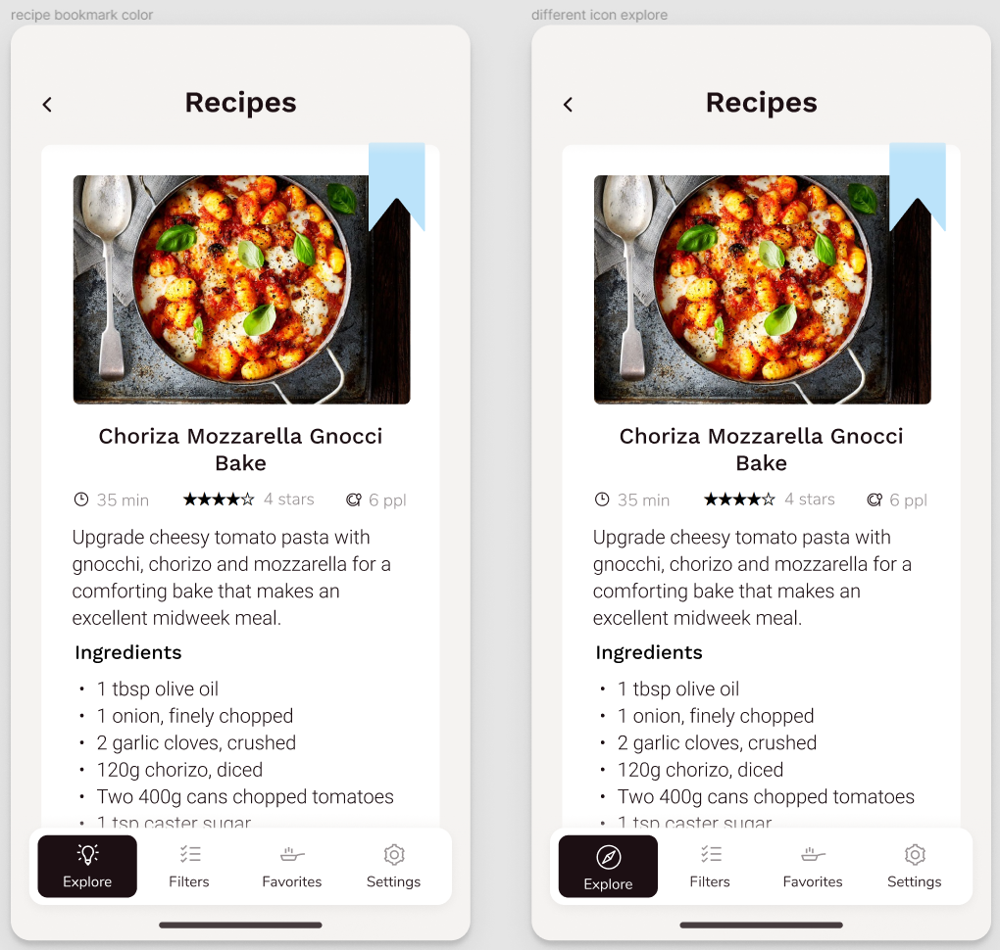

# Interactive Prototypying

## Digital Humanities 110 by Michelle Tran Bui 

### Tasks
After receiving feedback from the impression test from various users, I've finalized the prototype for my design of Slim Palate by creating more screens with included interactions. The main goal was to better integrate the three tasks I originally designed for my mobile app, and to create a navigation flow throughout the design. 

The tasks that will be demonstrated will be the incorporation of three features:

> Favorites Bookmark: The Favorites Bookmark gives the user the ability to save recipes they want to use in the future, and users can access all their favorited recipes in a specific tab.

> Recipe Time Tool: The Recipe Time tool finds recipes that is within the time frame you need it to be, allowing the user to personalize their needs and find what they need faster.

> Recommendation Tool: The Recommendation tool features a multitude of categories like the genre/ethnicity/culture of the food as well as what category of food you are looking to make (ie. food for maintaining weight, bulking food, cutting food, comfort food, energy-rich food).

### Impression Testing

[Here](https://www.figma.com/file/eJeO4e35IBf7p9BptgnNIp/activity-6?node-id=0%3A1) is the link for the impression testing. Unfortunately, my classmates didn't comment on my wireframe so instead I asked friends to answer the questions and added their responses as comments. 

### Interactive Prototype

[Here](https://www.figma.com/proto/eJeO4e35IBf7p9BptgnNIp/activity-6?node-id=22%3A207&scaling=min-zoom&page-id=22%3A206)'s the link to the prototype. 

### Wireflow

### Cognitive Walkthrough

[Here](https://www.youtube.com/watch?v=DAMWJPSQedo&ab_channel=michelletranbui) is the link for the video of the cognitive walkthrough. 

#### Summary
### Reflection

For the cognitive walkthrough interview, I asked my participant to attempt to complete three tasks and observed their method of thinking/processing as they navigated through the app. Two out of the three tasks were completed quickly and easily, according to my participant. However, for the second task, there was an issue in my user's navigation to complete my task. I realized that this was in part due to the way the pages were prototyped, which made it difficult for my participant to see which objects in the prototype were clickable and which ones weren't. Furthermore, I realized that my wording of said task was a little confusing, which led to my participant wandering aimlessly around the app hoping to accomplish what I asked them to do. For future reference, I'll make sure to have the objects that can be clicked on closer to the top of the page rather down at the bottom where they could easily be missed.

Overall, the cognitive walkthrough process was simple and successful. My participant reflected that he really liked the clean, minimalistic design that is easy to look at. When I asked for some potential future implementation ideas that he had or any suggestions, he mentioned how changing the color of the 'unbookmarked' feature might make it more obvious to the user's eye. One interesting comment he made was that the current gray color sort of blends into the photo of the food. He did note that this might be because the photo being used had a dark background, but suggested changing the bookmark color into a light blue could help it stand out more while denoting that the page has not been bookmarked yet. 

Another thing my participant suggested was including user personalization in regards to the app color. He pointed out that there is a 'Dark Mode' and 'Night Mode' option in the Settings, so he's looking forward to seeing the implementation later on. I found this to be an interesting suggestion because I had thought of adding these different color modes as a nice touch--but hearing a user like this option reinforced my original thinking. 

In conclusion, I found the cognitive walkthrough process to be, again, very helpful. Not only did it help me understand what another person is thinking when first using the prototype, it brings up issues that I myself wouldn't have uncovered. The extra perspective is also extremely helpful in hearing alternative ideas, options, and design decisions.

#### Future Changes

Considering my participant's input, I've changed the bookmark color to be a light blue to stand out more against the food photo. I also changed the 'Explore' icon, which my participant did note was a minor fix. Generally, my user seemed to be happy with the user experience and design of the website, and also enjoys the flow. Here are the photos of the small implementations and changes. 

