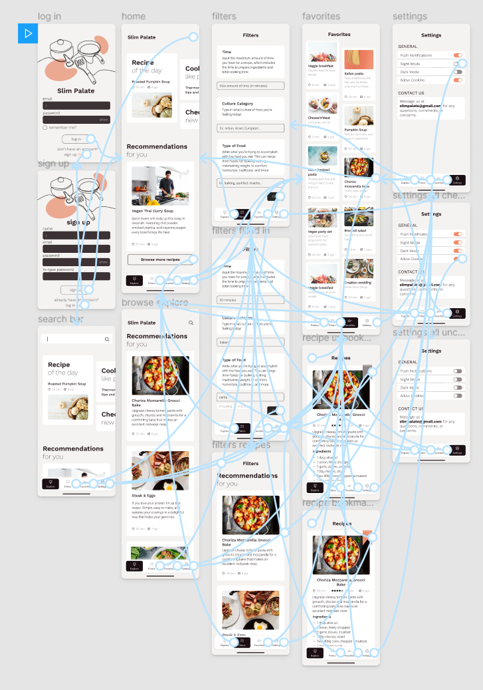

# Interactive Prototypying

## Digital Humanities 110 by Michelle Tran Bui 

### Interactive Prototype
[Here](https://www.figma.com/proto/eJeO4e35IBf7p9BptgnNIp/activity-6?node-id=22%3A206&scaling=min-zoom&page-id=22%3A206)'s the link to the prototype. 
### Wireflow

### Cognitive Walkthrough

#### Summary

### Reflection
#### Summary
#### Future Changes
