# Slim Palate: A Personalized Recipe App

## Digital Humanities 110 - Michelle Tran Bui

### Introduction

One of the trendiest chefs in social media, Joshua Weissman is popular on YouTube, TikTok, and Instagram because of his bright, comedic personality that presents easy-to-follow and great tasting recipes. Considering that many college students move out for the first time in the beginning of their academic career, Joshua's videos and short snippets are great resources to learn dishes that range from simple, 20 minute recipes to extragavant, rich-tasting dinners that looks like they were from a boujee restaurant. One of his first platforms on the internet was his own personal blog and recipe website, Slim Palate, which he started when he was only 16 years old. His last recipe post is dated back to 2017, and now he's currently 25 years old.

This project is focused on creating a user-friendly cooking website that has a plethora of recipes that are easy to access, find, and use. The website helps specific audiences ie. powerlifters, athletes, or the elderly to find recipes that suit their dietary needs, and time allotment. 

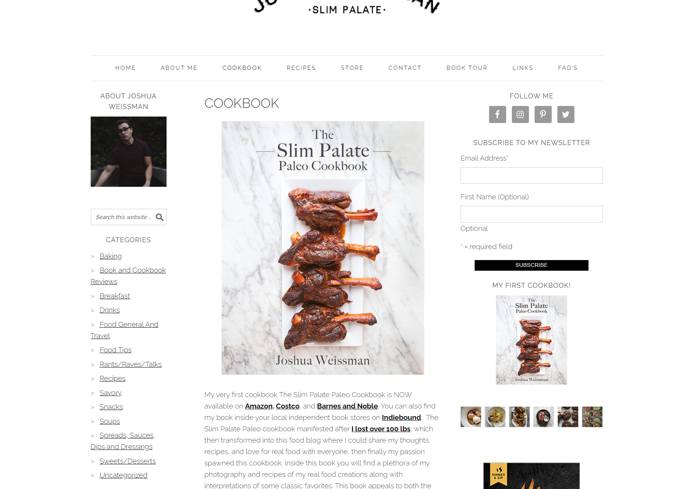

### Design Statement

The issue is that there aren't many recipe apps and websites out there that offer personalized features for the user. Many home-chefs and just people in general sometimes have very specific nutritious goals that recipe apps can't accomodate to, and the design of Slim Palate is to address those shortcomings. It's important to resolve that issue to offer higher personalization to increase overall diet and nutritious health. To accomplish these goals, three features were implemented to increase user personalization in the mobile app:

> **Recipe Time Tool**: Finds recipes that is within the time frame you need it to be. 

> **Favorites Bookmark**: Gives the user the ability to save recipes they want to use in the future, and users can access all their favorited recipes in a specific tab.

> **Recommendation Tool**: Compiles user ratings and reviews on the recipe and recommends which recipes are the most popular with the highest ratings.

### Competitor Analysis 
#### Heuristics Evaluation 

Considering the age of his website, the heuristic evaluation of Joshua Weissman's website 'Slim Palate' yields a multitude of usability issues. One of the most outstanding issues is the flexibility and efficiency to use--the website lacks typical cooking website features like "jump to recipe" or "save recipe", making it more difficult for beginner chefs to navigate and organize recipes. Second, there is little room for user control and freedom. Users on his website can't easily navigate to the previous page they were on, and the only real exit button is navigating back to the beginning. Third, there's not a good match between the system and the real world. The design of the website is very stagnant and unresponsive to user interaction, while the layout is difficult to follow. Joshua Weissman's recipes are also oddly organized and result in user interactions that aren't ideal. A fourth concern is the unorganized and unpleasing aesthetic of the website. The cluttered design is messy and hard-to-navigate, and also sports very boring colors.

Jack Nielson's 10 Usability Heuristics for UI Design can be read about [here](https://www.nngroup.com/articles/ten-usability-heuristics/).

#### Usability Testing

A usability test was conducted to understand the website's design and it's resulting impact on the user's ability to complete frequent and common tasks. The test will observe the overall user satisfaction and efficiency of Slim Palate. The first task will ask the user to search for a simple steak recipe, to see how quickly and efficiently users can navigate the website to find what to took. This task questions the website's user control and freedom as users attempt to search for something that they need. The second task will test the website's help and documentation for users who have any questions. The user will be tasked with finding out answers to general questions, and whether or not they can contact someone about the website. The final task will be to start from the home page and look for a new dessert to test the match between the system and the real world, considering that the website's functionality is somewhat cumbersome. In conclusion, the purpose of the usability test is to pinpoint the user experience and overall improve the usability and functionality for the user.

More information on the usability testing can be accessed [here](https://github.com/michelletranbui/dh110-michelle/tree/main/assignment02).

### User Research
#### Contextual Inquiry

A contextual inquiry is conducted to understand the environment in which users would access a certain website. I conducted a contextual inquiry on users who would use the California EDD Unemployments Website to see what features of the website are helpful, inaccessible, and can therefore be improved upon.

More information on the contextual inquiry can be accessed [here](https://github.com/michelletranbui/dh110-michelle/tree/main/assignment03).

### UX Storytelling 

UX Storytelling is important for the purpose of understanding what the user needs, accomodating their motivations and desires, and to make their experience as easy, memorable, and satisfactory as possible. For my project, UX storytelling is imperative so I can modify and adjust Slim Palate to cater to a wide variety of people--from students, to full-time workers, and more. By imagining different populations of users, I can diversify the features, effectiveness, and utility of the website.

Two personas and journey maps were developed to visualize the possible user population for Slim Palate. 

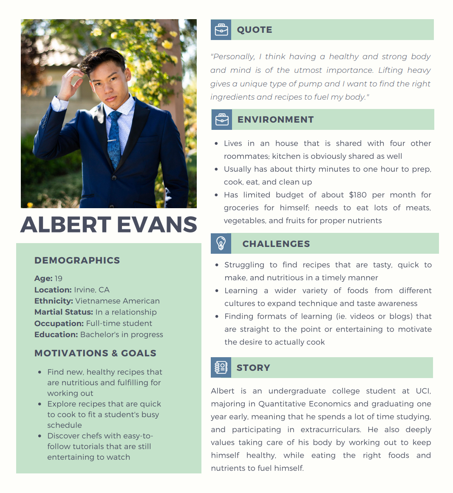
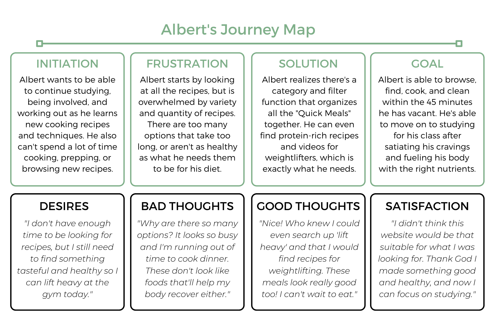
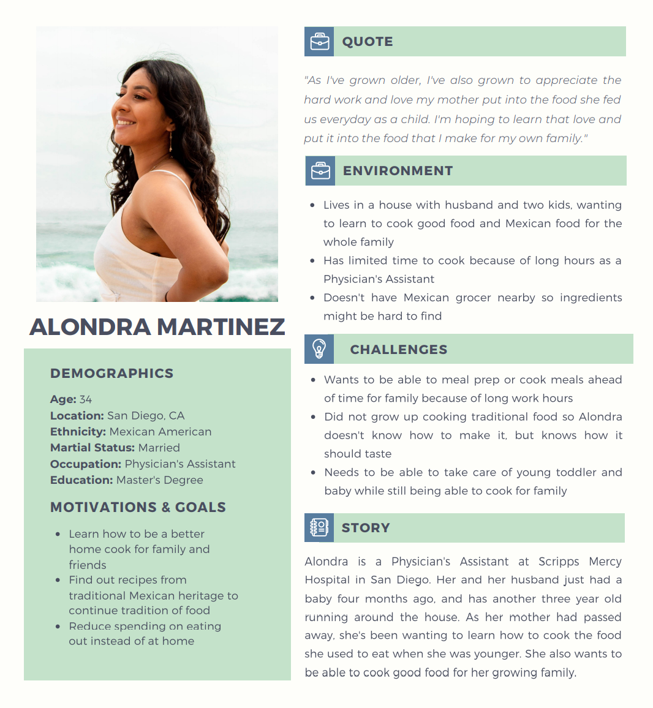
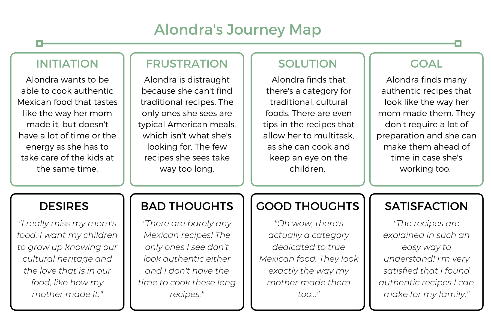

More information on the personas imagined for Slim Palate can be accessed [here](https://github.com/michelletranbui/dh110-michelle/tree/main/assignment04).

### Low-Fidelity Prototype

The purpose of creating and testing this low-fidelity prototype is to see whether the features being introduced are implemented properly, are useful to the audience, and if there are any issues with them. By having participants use the features and see any difficulties or advantages that they experience, I can further the advancement of these features by better modifying them. The tasks will specifically ask the user if the features are useful, if there's anything odd about them that can be improved on, and if the user can find out how to use the feature itself.

These three features will be introduced to the website to improve user experience and ease of access.

> **Recipe Time Tool**: Finds recipes that is within the time frame you need it to be. 

> **Favorites Bookmark**: Gives the user the ability to save recipes they want to use in the future, and users can access all their favorited recipes in a specific tab.

> **Recommendation Tool**: Compiles user ratings and reviews on the recipe and recommends which recipes are the most popular with the highest ratings.

More information on the lo-fi prototype can be accessed [here](https://github.com/michelletranbui/dh110-michelle/tree/main/assignment05).

### High-Fidelity Prototype

The purpose of the high-fidelity prototype is to see whether or not my design of 'Slim Palate' is cognitively functional, if the impression on users is positive or negative, and what further user feedback can be discovered to adjust and improve the prototype. The prototyping also serves to discover any mistakes in the design and to fix them immediately to ensure that the user experience is simple and seamless.

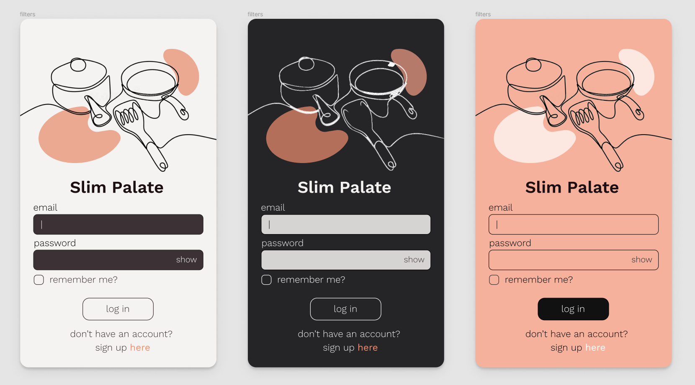
Here are the three different color variations being tested for the general app color scheme. The three modes are light mode, dark mode, and a color mode/variant. For the final product of the app, I decided to stick with the light and dark modes so users have the ability to toggle between both modes. I discarded the color mode variant as a potential idea because I think the more minimalistic color schemes have a nicer aesthetic for the overall design.

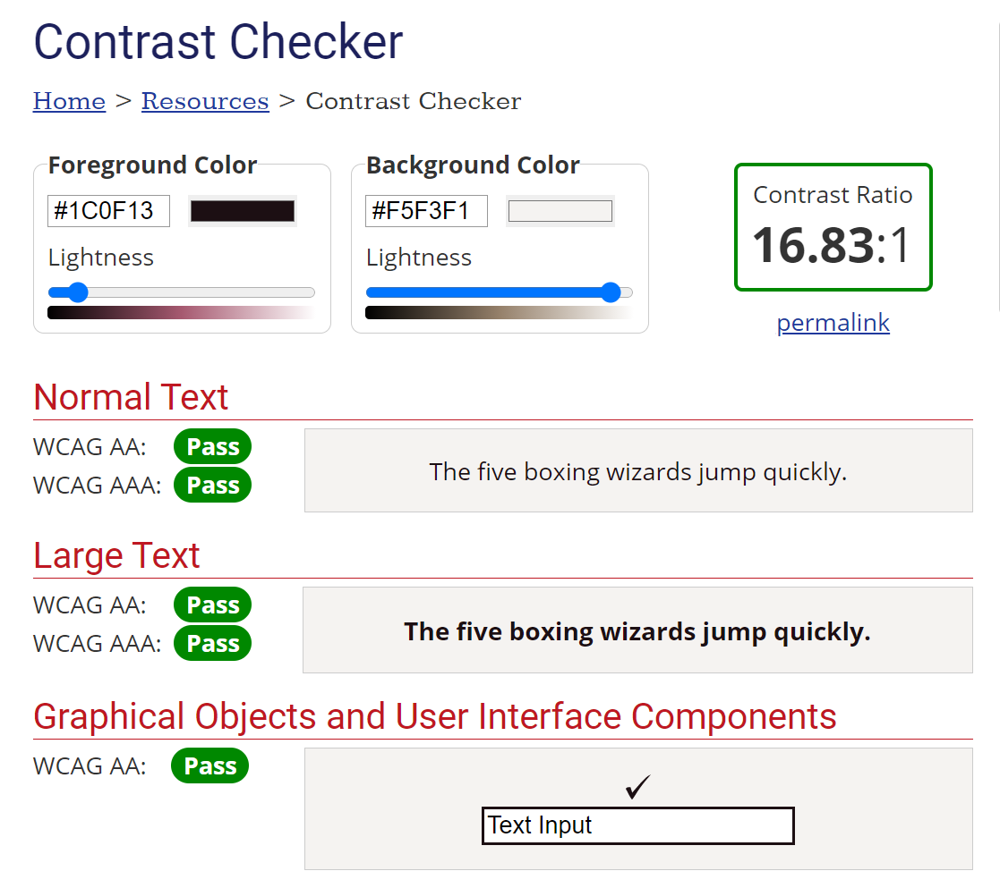
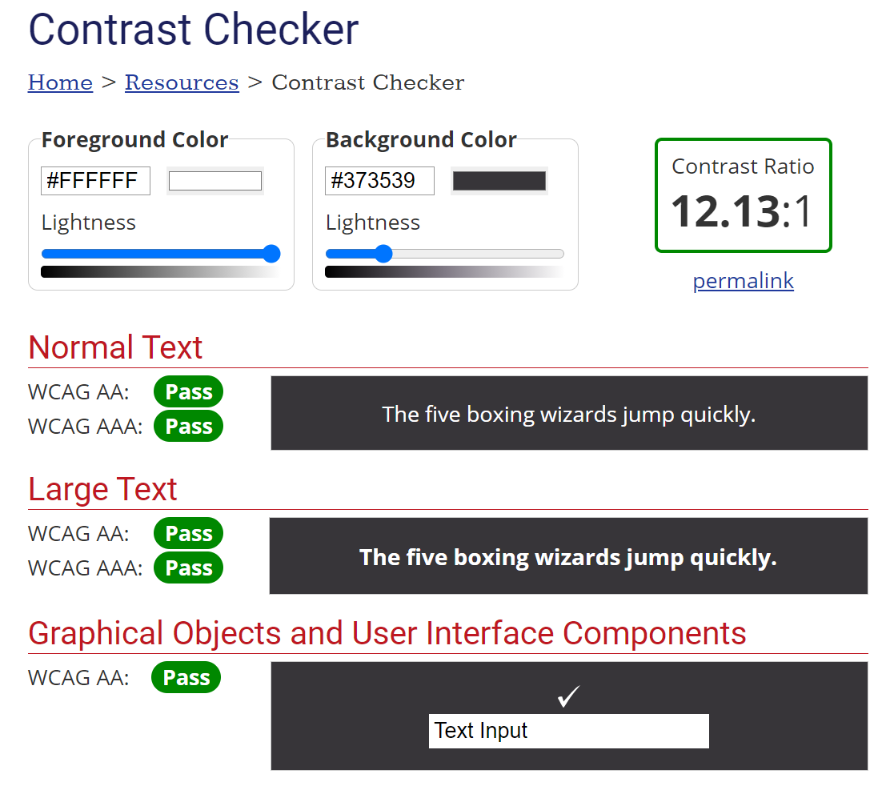
To ensure that the mobile application is accessible, I conducted a WCAG color-pair contrast test. Both of the light and dark mode variants with their respective font colors passed the accessibility checks.

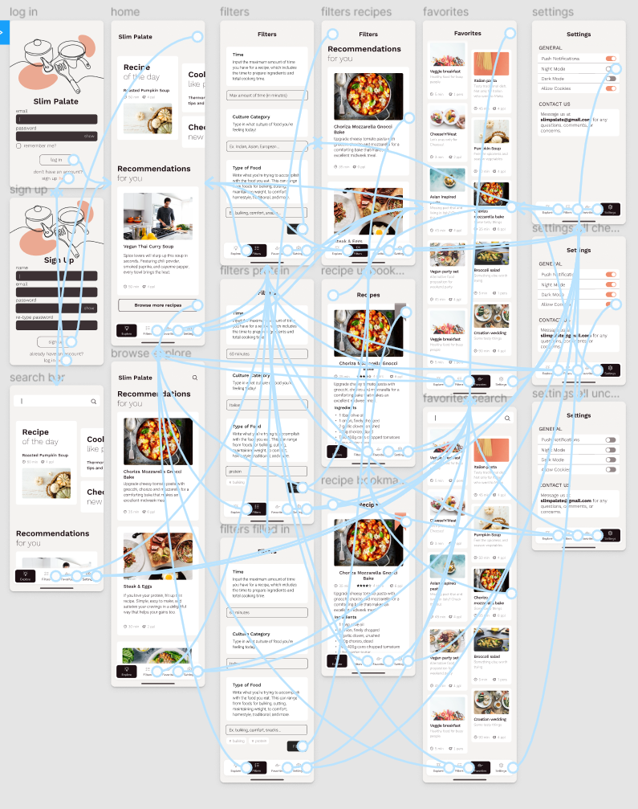
<iframe style="border: 1px solid rgba(0, 0, 0, 0.1);" width="800" height="450" src="https://www.figma.com/embed?embed_host=share&url=https%3A%2F%2Fwww.figma.com%2Fproto%2FeJeO4e35IBf7p9BptgnNIp%2Factivity-6%3Fnode-id%3D13%253A11%26scaling%3Dmin-zoom" allowfullscreen></iframe>

More information on the hi-fi prototype can be accessed [here](https://github.com/michelletranbui/dh110-michelle/tree/main/assignment06).

### Evaluation and Revision 

To evaluate the functionality of my design, I asked a few peers to participate in impression testing and a cognitive walkthrough. For the cognitive walkthrough interview, I asked my participant to attempt to complete three tasks and observed their method of thinking/processing as they navigated through the app. Two out of the three tasks were completed quickly and easily, according to my participant. However, for the second task, there was an issue in my user's navigation to complete my task. I realized that this was in part due to the way the pages were prototyped, which made it difficult for my participant to see which objects in the prototype were clickable and which ones weren't. Furthermore, I realized that my wording of said task was a little confusing, which led to my participant wandering aimlessly around the app hoping to accomplish what I asked them to do. For future reference, I'll make sure to have the objects that can be clicked on closer to the top of the page rather down at the bottom where they could easily be missed.

In conclusion, I found the cognitive walkthrough process to be, again, very helpful. Not only did it help me understand what another person is thinking when first using the prototype, it brings up issues that I myself wouldn't have uncovered. The extra perspective is also extremely helpful in hearing alternative ideas, options, and design decisions.

Considering my participant's input, I've changed the bookmark color to be a light blue to stand out more against the food photo. I also changed the 'Explore' icon, which my participant did note was a minor fix. Generally, my user seemed to be happy with the user experience and design of the website, and also enjoys the flow. Here are the photos of the small implementations and changes. I followed my user's suggestions because I agree with their reasoning, which they explained in the cognitive walkthrough video or in the impression testing.

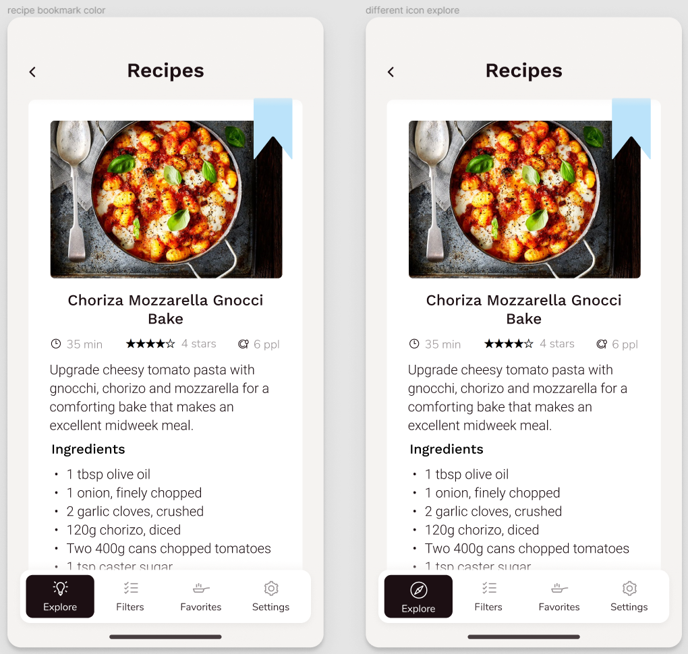
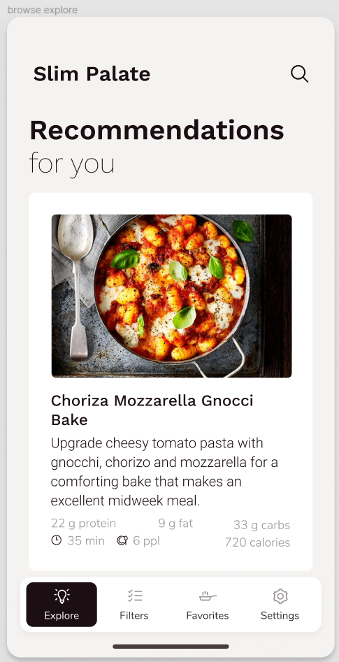

More information on the impression testing and cognitive walkthrough can be found [here](https://github.com/michelletranbui/dh110-michelle/tree/main/assignment07).

### Pitch

[Here](https://youtu.be/b1TWVm-_UGA) is the video pitch. 

### Conclusion 

Overall, I was happy with my end result of the mobile app design. I was able to generally implement the three features I originally came up with. I learned that understanding true user experience was putting myself into the users shoes and thoughts and imagine the thought process to really be able to create the best experience. Throughout the project, I found how easy it is to make simple errors that could be accidentally overlooked, which lead to cumbersome issues and obstacles for the user browsing through the app/website. I also learned about the various processes that go behind-the-scenes of product design, like the impression testing, cognitive walkthrough, heuristic evaluation, and usability testing. I never knew that there so was much extensive research and testing behind the design of a process, but it now makes so much sense that all this work is put into finding what design is really the most ideal. These hard skills were some of the biggest things I've learned throughout the course. 

The project also taught me different types of design and ideas that I could implement into website and app design. It widened my creative knowledge into what I could possibly create and the different concepts I could follow with an application design, which I extremely appreciate as UI/UX is what I want to pursue as my future career. The overall experience has been priceless as I've been taught a variety of techniques, skills, and methods that I would need as a future UX researcher or UI designer. 
